# Smart Farming Ethiopia

Farmer-focused Flutter mobile application for smart agriculture workflows in Ethiopia. The app supports offline field work, crop disease scanning, farm record management, soil and weather guidance, alerts, yield outlook, and multilingual farmer-facing guidance.

This repository contains the Flutter mobile app only. The Laravel API/back-office and the optional online inference service are separate runtime components.

## Project Purpose

Smart Farming Ethiopia was developed as an applied technology-transfer project for career promotion from Assistant Instructor to Instructor.

- Developer: Admasu Feleke Mulatu
- Email: admasu.feleke21@gmail.com
- Phone: 0900824328
- Institution: Dalocha Polytechnic College
- Approval context: Technology Transfer Core, Dalocha Polytechnic College
- Target users: Farmers using Android phones in field conditions

## Core Features

- Farmer account login and self-registration
- Offline login after a successful online session
- Farm, plot, and planting management
- Crop-aware disease scan flow
- Offline TensorFlow Lite inference for supported crops
- Online API sync for expert/supporter verification
- Disease history with image evidence and treatment guidance
- Soil health records, evidence capture, and offline/online guidance
- Weather monitoring and field advisory screens
- Disease prevention and yield outlook
- Alerts and sync diagnostics
- Localization for Amharic, Afaan Oromo, Tigrinya, and English

## App Screenshots

These screenshots show the farmer-facing Android app, including the redesigned dashboard, farm management, scan flow, disease prevention, soil guidance, weather, and localized field screens.

| Home and farm | Scan and crop context | Pest/disease prevention |
| --- | --- | --- |
| 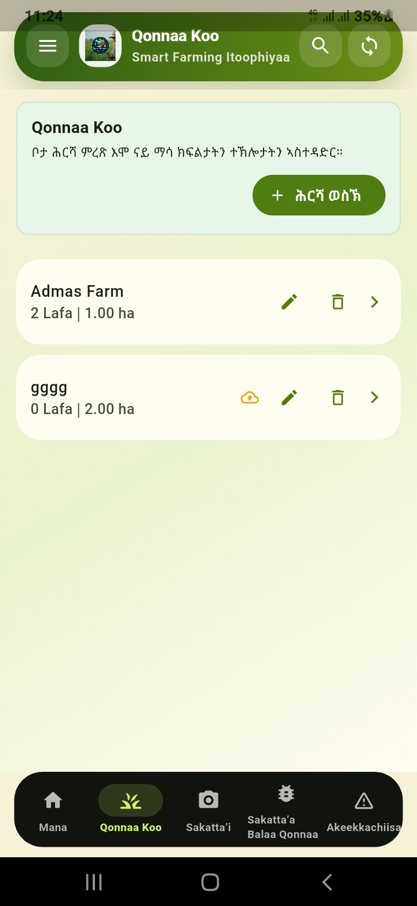 | 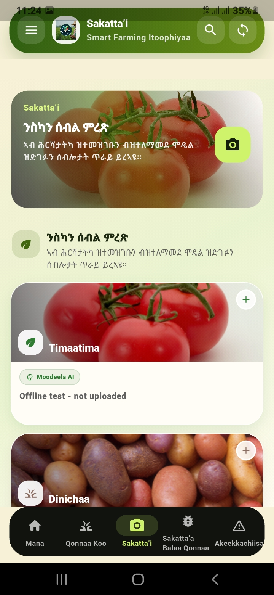 | 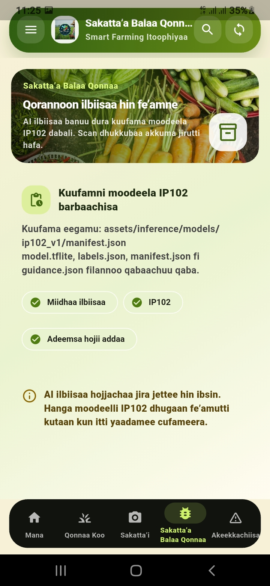 |
| 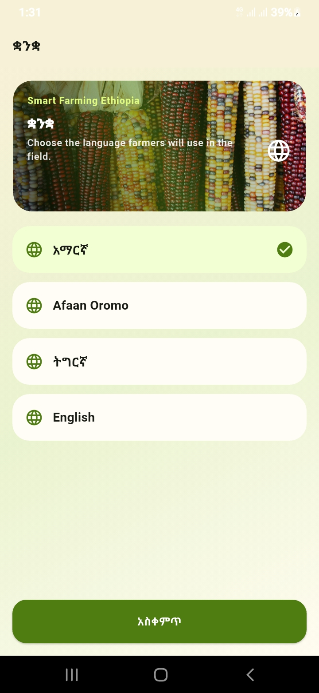 | 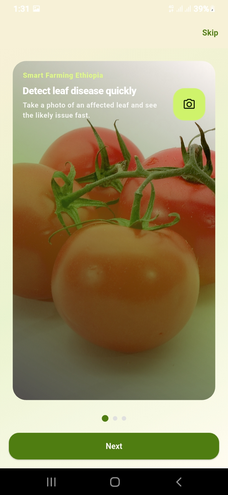 | 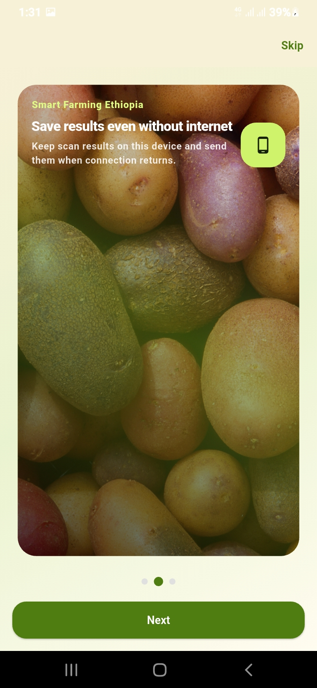 |
| 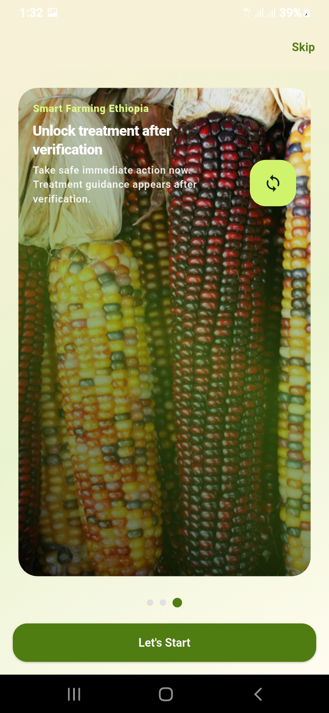 | 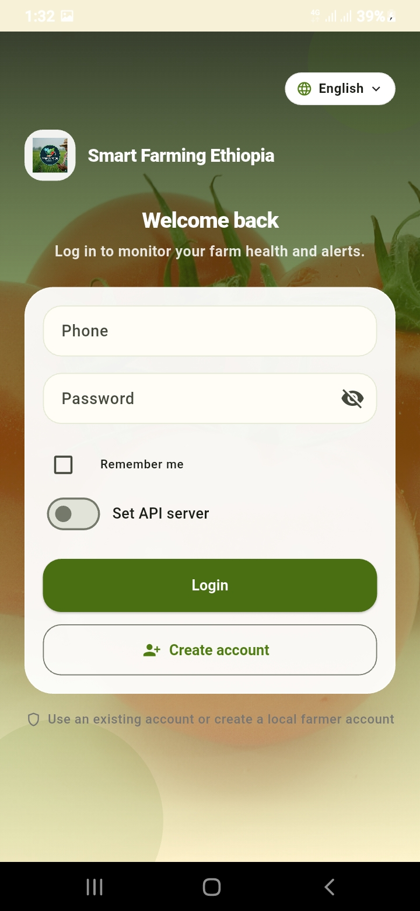 | 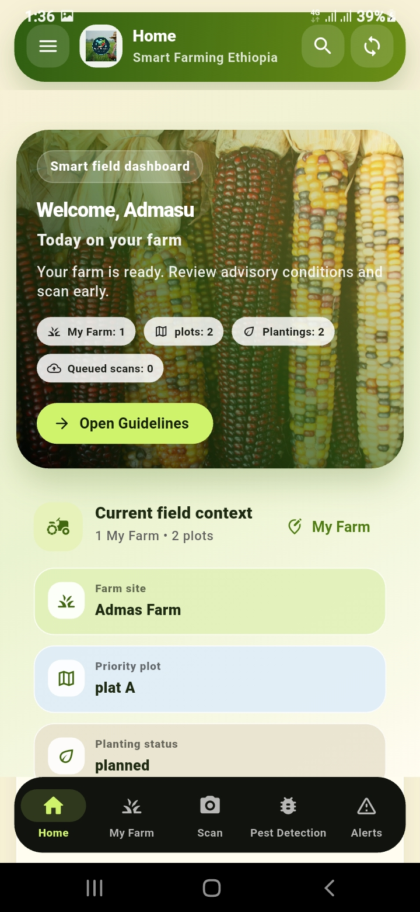 |
| 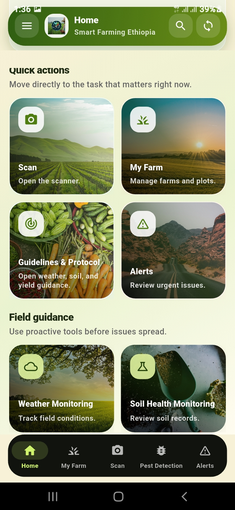 | 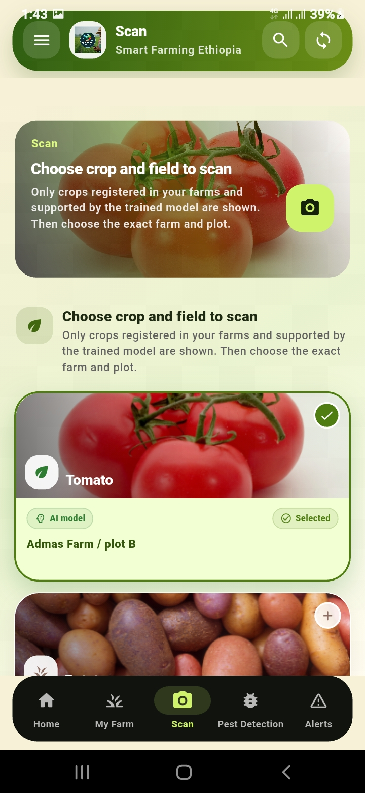 | 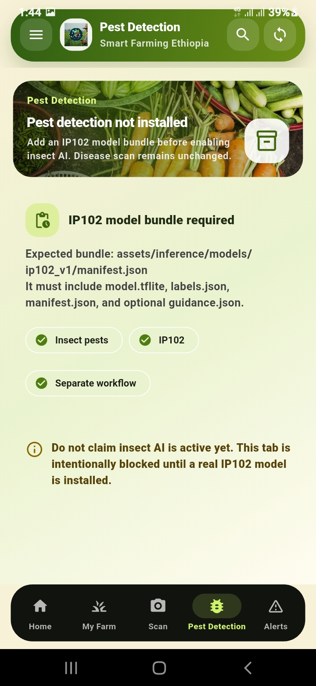 |

## Supported Crop Disease Scan Models

The mobile app includes local TensorFlow Lite model bundles under `assets/inference/models/`.

Currently supported crop families:

- Tomato
- Potato
- Pepper
- Maize

The scan flow keeps model labels canonical internally and localizes only farmer-facing display names. This avoids breaking offline inference, online upload, and disease-history sync.

## Architecture

The app uses an offline-first mobile architecture.

```text
Flutter app
  |
  |-- Local SQLite cache
  |-- Secure token/session storage
  |-- Pending sync queues
  |-- Offline TFLite crop disease inference
  |
  +-- Laravel API
        |
        |-- Farmer-owned data
        |-- Disease report review workflow
        |-- Soil/weather/yield recommendations
        |-- Optional online inference service
```

Runtime behavior:

- Laravel remains the system of record.
- Farmers can keep working offline after an authenticated session.
- New local records are queued and synced when the API becomes reachable.
- Disease scan images are saved locally and uploaded as evidence when sync is possible.
- Expert/supporter review happens through the backend/back-office workflow.

## Repository Structure

```text
lib/
  app.dart                         App shell, navigation, session revalidation
  api_client.dart                  Laravel API client
  auth_session.dart                Secure auth/session persistence
  localization.dart                Main UI translations
  disease_naming.dart              Canonical/local disease display names
  features/
    auth/                          Login and account creation
    home/                          Farmer dashboard
    my_farm/                       Farms, plots, plantings, yield outlook
    scan/                          Camera scan, offline inference, scan queue
    disease/                       Disease history and prevention
    soil_health/                   Soil records and guidance
    weather/                       Weather monitoring
    alerts/                        Farmer alerts
    more/                          Drawer/more tools
  offline/                         SQLite repository and sync services
  widgets/                         Shared UI components

assets/
  images/                          Logo, crop images, home card images
  inference/models/                Offline model bundles

tools/
  ip102/                           Experimental insect-detection preparation tools

docs/
  IP102_INSECT_MODEL_ALIGNMENT.md  Insect-model alignment notes
```

## Requirements

- Flutter SDK
- Dart SDK bundled with Flutter
- Android SDK / Android Studio
- A connected Android device or emulator
- Laravel API for full online and sync behavior

Recommended checks:

```powershell
flutter pub get
dart analyze lib
flutter test
```

## Running Locally

From the Flutter project root:

```powershell
cd C:\Users\Admas\smart_farm
flutter pub get
flutter run
```

Configure the API URL from the login screen. For physical Android devices, do not use `127.0.0.1` unless the API is running inside the same device. Use the computer LAN IP address that the phone can reach.

Example:

```text
http://192.168.x.x:8000
```

## Building Release APKs

Run the build command from the project root where `pubspec.yaml` exists.

```powershell
cd C:\Users\Admas\smart_farm
flutter build apk --release --split-per-abi
```

Release outputs are generated under:

```text
build/app/outputs/flutter-apk/
```

Generated APKs should not be committed to GitHub.

## Offline Capability

The app is designed for low-connectivity farmer environments.

Offline-supported areas:

- Login unlock after a previous online login
- Farm/plot/planting local records
- Soil health records and local guidance
- Disease scan provisional results
- Disease scan image retention
- Pending scan/report replay after reconnect
- Cached disease history and advisory data

Online-required areas:

- First account verification/login
- Server-side review and confirmation
- Backend-approved treatment registry updates
- Weather refresh from server/API
- Yield prediction verification
- Supporter/expert decisions

## Localization

The app supports:

- Amharic
- Afaan Oromo
- Tigrinya
- English

Localization covers static UI strings and major farmer-facing guidance. Disease model names are mapped from canonical labels to local display names where reliable local names exist. Where a verified local disease name is not available, the app uses descriptive farmer-readable wording instead of inventing unsupported names.

## Inference Notes

Offline inference is intended to provide provisional field guidance. Server sync and expert review remain important for final confirmation.

Important constraints:

- Offline inference is not a replacement for expert diagnosis.
- Healthy results should still be monitored if symptoms spread.
- Treatment guidance should follow locally approved pesticide and agronomy recommendations.
- Model labels must remain stable to protect sync and history consistency.

## GitHub Hygiene

Do not commit generated or local-only files:

- `.dart_tool/`
- `build/`
- `.venv/`
- `.flutter-plugins-dependencies`
- APK outputs
- Python `__pycache__/`
- local logs or temporary files

Before pushing:

```powershell
flutter clean
flutter pub get
dart analyze lib
```

## Status

Current project state: production-readiness refinement.

Completed focus areas:

- Farmer-only mobile workflow
- Offline-first data handling
- Crop-aware disease scanning
- Image evidence capture and sync
- Farmer-facing localization
- Soil, weather, disease prevention, and yield guidance screens
- Android release build path

Remaining recommended work:

- Full expert validation of Oromo and Tigrinya disease terminology
- Schema-backed localization for backend treatment registry content
- Final end-to-end QA on real Android devices
- Release signing and deployment configuration
